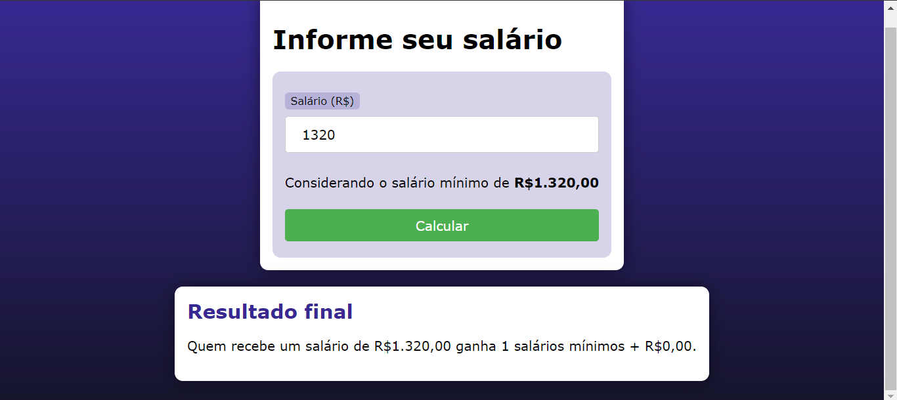

# SALARIO MINIMO COM PHP
👨‍🏫PROJETO CRIADO PARA O CURSO DE PHP.

  

## DESCRIÇÃO:
Este aplicativo calcula quantos salários mínimos uma pessoa recebe com base no seu salário informado. O usuário insere o valor do seu salário, e o aplicativo calcula e exibe quantos salários mínimos completos isso equivale e qual é o valor restante.

- **Entrada:** Você insere um salário de R$ 3000,00.
- **Saída:** O aplicativo informará que este valor equivale a 2 salários mínimos completos (R$ 1320,00 cada) e um valor restante de R$ 360,00.

- O valor do salário mínimo está definido no código como R$ 1320,00.
- Se nenhum valor for inserido, o aplicativo assume o valor padrão do salário mínimo (R$ 1320,00).

## EXECUTANDO O PROJETO:
1. **Executando o Aplicativo:**
   - Coloque os arquivos em um servidor web compatível com PHP (por exemplo, XAMPP, WAMP, LAMP).
   - Acesse o formulário no navegador visitando `http://localhost/CODIGO/index.php`.

2. **Interagir com o Projeto:**
   1. **Abrir a Página Inicial**
      - Ao abrir a página inicial do aplicativo, você verá um formulário com um campo de entrada para inserir o valor do seu salário.

   2. **Inserir o Salário**
      - No campo "Salário (R$)", insira o valor do seu salário mensal. O valor deve ser um número, e pode incluir centavos (ex.: 2500.75).

   3. **Enviar o Formulário**
      - Clique no botão "Calcular" para enviar o formulário. O aplicativo processará o valor inserido.

   4. **Visualizar o Resultado**
      - A página será recarregada e exibirá o resultado abaixo do formulário. O resultado mostrará:
      - O número de salários mínimos completos que seu salário representa.
      - O valor restante que não completa outro salário mínimo.
   
## CREDITOS:
- [PROJETO CRIADO PARA O CURSO DE PHP](https://github.com/VILHALVA/CURSO-DE-PHP)
- [PROJETO FEITO PELO VILHALVA](https://github.com/VILHALVA)

